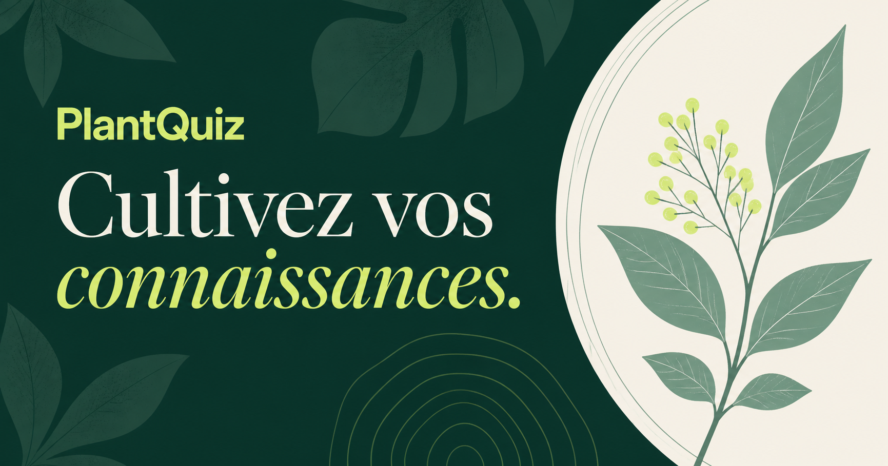

# PlantQuiz



**PlantQuiz** est une application web de révision consacrée à la biologie végétale. Elle rassemble un quiz adaptatif, des sessions ciblées par semestre et un Pédantix végétal dans une interface légère, responsive et sans compte utilisateur.

🌿 **[Ouvrir PlantQuiz](https://edezi.github.io/plantquiz/)**

## Les modes de jeu

### Défi Elo

Le niveau évolue après chaque réponse. Le moteur privilégie les questions proches du niveau estimé, présente progressivement les nouvelles notions et repropose les thèmes moins bien maîtrisés.

- 991 questions ;
- 6 niveaux de difficulté ;
- sessions de 10, 20 questions ou durée libre ;
- prise en charge des QCU, QCM et Vrai/Faux ;
- progression conservée localement dans le navigateur.

### Révision ciblée

Le mode Révision permet de choisir un semestre, une ou plusieurs unités d’enseignement et une durée de session. Il ne modifie jamais le score Elo.

- 792 questions réparties entre S5, S6 et S7 ;
- sessions de 5, 10, 20 questions ou banque complète ;
- bilan final avec les erreurs, les réponses attendues et les explications.

### Pédantix végétal

Un titre est masqué ainsi que le texte qui le décrit. Chaque proposition révèle les occurrences correspondantes et certaines formes françaises proches.

- 200 énigmes disponibles ;
- énigme quotidienne déterministe, même après la dernière date de la banque ;
- archives accessibles par date ;
- indices, progression, abandon et reprise après rechargement ;
- état sauvegardé uniquement sur l’appareil.

### Outil enseignant

Un générateur aide à préparer de nouvelles questions au bon format JSON. Il produit un tableau à copier manuellement et ne modifie aucun fichier du dépôt.

## Choix techniques

PlantQuiz reste volontairement simple à héberger :

- HTML5, CSS3 et JavaScript moderne sans framework ;
- modules JavaScript séparés par responsabilité ;
- aucune dépendance de production ;
- stockage local pour la progression ;
- déploiement direct avec GitHub Pages ;
- tests basés uniquement sur le moteur de test intégré à Node.js.

Les banques de questions existantes n’ont pas été modifiées lors de la refonte de l’interface et des moteurs de jeu.

## Lancer le projet localement

Node.js 22 ou une version récente suffit :

```bash
git clone https://github.com/EdeZi/plantquiz.git
cd plantquiz
node scripts/serve.mjs
```

Ouvrez ensuite [http://127.0.0.1:4173](http://127.0.0.1:4173).

## Vérifier le projet

```bash
node scripts/validate-data.mjs
node --test
```

Le premier contrôle valide la structure des trois banques JSON. Le second teste le calcul Elo, les réponses multiples, la préparation des sessions et le moteur Pédantix.

## Structure

```text
plantquiz/
├── assets/
│   ├── js/
│   │   ├── app.js                # écrans, navigation et interactions
│   │   ├── data.js               # chargement et normalisation des banques
│   │   ├── pedantix-engine.js    # moteur de révélation et sélection quotidienne
│   │   ├── quiz-engine.js        # sélection adaptative et calcul Elo
│   │   └── storage.js            # progression locale
│   ├── og-card.png               # aperçu pour les partages
│   └── styles.css                # identité visuelle et responsive
├── data/
│   ├── pedantix_daily.json
│   ├── questions_normal.json
│   └── questions_revision.json
├── scripts/
│   ├── serve.mjs
│   └── validate-data.mjs
├── tests/
├── index.html
└── package.json
```

## Origine du projet

Projet pédagogique réalisé dans le cadre du M2 par **Louis Grard, Alan Gaubert, Léo Giornelli, Steven Charmant et Mathieu Druenne** pour le parcours Biologie Végétale de Montpellier.
