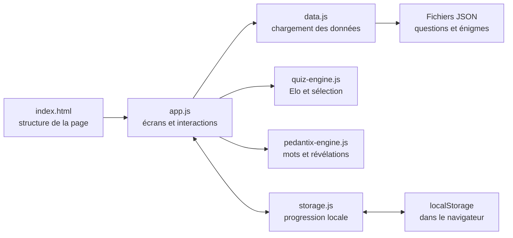

# Guide de reprise de PlantQuiz

Ce document s’adresse à une personne qui connaît surtout la biologie et qui souhaite comprendre ou modifier PlantQuiz sans devoir maîtriser immédiatement tout le vocabulaire du développement web.

## 1. L’idée générale

PlantQuiz est un site web statique : il n’a ni serveur applicatif, ni base de données, ni compte utilisateur. GitHub Pages envoie les fichiers au navigateur, puis le navigateur fait fonctionner l’application en JavaScript.

Les trois banques de contenu sont de simples fichiers JSON :

- `data/questions_normal.json` pour le Défi Elo ;
- `data/questions_revision.json` pour les révisions par semestre et UE ;
- `data/pedantix_daily.json` pour le Pédantix végétal.

Le fonctionnement peut se résumer ainsi :



L’intelligence artificielle a aidé à remettre le projet en forme en 2026, mais elle n’intervient pas lorsque le site fonctionne. Il n’y a aucun appel à une API d’IA, aucun coût d’utilisation et aucune clé secrète à configurer.

## 2. État du projet

Le projet original a été réalisé en 2025. La version 2026 est considérée comme une version finale et stable :

- l’interface a été modernisée ;
- l’ancien fichier principal a été séparé en modules plus faciles à lire ;
- le moteur Pédantix a été reconstruit ;
- des contrôles automatiques ont été ajoutés ;
- les banques de questions existantes ont été conservées lors de cette refonte.

« Projet terminé » signifie ici que le site est fonctionnel et présentable. Cela ne signifie pas que chaque enseignement de biologie végétale est couvert de manière exhaustive.

### État réel de la banque de révision

| Semestre | Nombre d’UE | Nombre de questions |
| --- | ---: | ---: |
| S5 | 1 | 138 |
| S6 | 1 | 3 |
| S7 | 5 | 651 |
| **Total** | **7** | **792** |

Aucun semestre n’est vide. L’unique UE du S6, « Autotrophie », est toutefois marquée `BIENTOT` et ne contient que trois questions. Les données ne possèdent pas de champ indiquant officiellement si une UE est terminée. Deux intitulés du S7 portent un symbole `✔️`, mais ce marquage n’est pas assez systématique pour calculer un nombre fiable de matières finies.

## 3. Installer et lancer le projet

### Prérequis

Il faut :

- Git, pour récupérer et envoyer le projet ;
- Node.js 22 ou une version récente, pour lancer le petit serveur local et les tests ;
- un navigateur moderne.

### Première installation

```bash
git clone https://github.com/EdeZi/plantquiz.git
cd plantquiz
npm run serve
```

Ouvrir ensuite `http://127.0.0.1:4173`.

Le terminal doit rester ouvert pendant l’utilisation locale. Pour arrêter le serveur, utiliser `Ctrl+C`.

### Pourquoi ne pas simplement ouvrir `index.html` ?

Le site charge les fichiers JSON avec `fetch`. Les navigateurs limitent généralement ce chargement lorsqu’un fichier HTML est ouvert directement depuis le disque. Le petit serveur local évite ce problème et reproduit mieux le fonctionnement de GitHub Pages.

## 4. Les fichiers importants

### `index.html`

C’est le squelette permanent du site : métadonnées, barre de navigation, zone principale et pied de page. Le contenu des écrans est ensuite inséré dans la balise `<main id="app">` par JavaScript.

### `assets/styles.css`

Ce fichier contient toute la présentation : couleurs, tailles, grilles, boutons, cartes et adaptation aux téléphones. Les variables placées au début du fichier permettent de changer rapidement l’identité visuelle.

### `assets/js/app.js`

C’est le chef d’orchestre. Il :

- lit l’adresse après le `#` pour choisir l’écran ;
- conserve l’état temporaire de la session en cours ;
- construit le HTML de chaque écran ;
- réagit aux clics, aux formulaires et au clavier ;
- appelle les moteurs de jeu ;
- demande au module de stockage de sauvegarder la progression.

Les routes principales sont `#/home`, `#/normal`, `#/revision`, `#/pedantix` et `#/teacher`. Une route après un `#` permet de naviguer dans une application monopage sans demander un nouveau fichier HTML au serveur.

### `assets/js/data.js`

Ce module charge les trois fichiers JSON et normalise leur contenu. « Normaliser » signifie transformer des données parfois légèrement différentes en objets qui ont toujours la même forme pour le reste de l’application.

Il crée aussi un identifiant interne composite pour chaque question. Ainsi, deux questions anciennes qui partageraient accidentellement le même identifiant texte ne se confondent pas dans les statistiques.

### `assets/js/quiz-engine.js`

Ce module contient la logique indépendante de l’interface : calcul Elo, choix adaptatif d’une question, vérification d’un QCM, mélange et limitation d’une session de révision.

### `assets/js/pedantix-engine.js`

Ce module découpe les textes en mots, ignore les accents et certaines différences simples de forme, révèle les occurrences, choisit les indices et sélectionne l’énigme quotidienne.

### `assets/js/storage.js`

Ce module lit et écrit dans le `localStorage`, une petite zone de stockage propre au navigateur et au site. Il n’envoie rien sur Internet.

### `scripts/` et `tests/`

- `scripts/serve.mjs` lance le serveur local ;
- `scripts/validate-data.mjs` contrôle les fichiers JSON ;
- `tests/` vérifie les parties sensibles des moteurs de jeu.

## 5. Comprendre les trois modes

### Défi Elo

Chaque question du Défi possède un niveau de 1 à 6. Ces niveaux correspondent à des valeurs Elo allant de 800 à 1800.

Après une réponse :

1. le moteur compare l’Elo de l’utilisateur au niveau de la question ;
2. une bonne réponse augmente l’Elo et une erreur le diminue ;
3. les douze premières réponses utilisent un réglage plus rapide pour calibrer le niveau ;
4. le score reste toujours compris entre 800 et 1800.

Pour choisir la question suivante, le moteur favorise :

- les questions proches du niveau estimé ;
- les questions jamais vues ;
- les notions déjà ratées ;
- les questions qui n’ont pas été proposées très récemment.

Ce n’est pas une évaluation académique officielle. L’Elo sert uniquement à ajuster progressivement la difficulté.

### Révision ciblée

L’utilisateur choisit un semestre, une ou plusieurs UE et une taille de session. Toutes les questions correspondantes sont rassemblées et mélangées, puis le nombre demandé est prélevé.

Les réponses de Révision alimentent le nombre total de réponses et la précision cumulée, mais elles ne changent jamais l’Elo.

### Pédantix végétal

Le moteur recherche d’abord une entrée portant exactement la date du jour. S’il n’en trouve pas, il effectue une rotation stable dans les 200 énigmes : une même date affiche donc la même énigme.

Une proposition :

- est mise en minuscules ;
- est comparée sans accents ni ponctuation ;
- peut correspondre à quelques variantes françaises simples grâce à une réduction légère des suffixes ;
- révèle toutes les occurrences trouvées dans le texte.

Le titre complet doit être proposé pour gagner. Cette comparaison volontairement légère n’est pas un véritable analyseur linguistique : certaines formes complexes peuvent ne pas être reconnues.

### Outil enseignant

L’outil enseignant facilite la préparation d’une question, mais il ne peut pas écrire dans le dépôt depuis le navigateur. Il génère un objet JSON à copier, puis un responsable doit l’insérer dans le bon fichier et exécuter les contrôles.

## 6. Ce qui est mémorisé

Deux entrées sont utilisées dans le navigateur :

- `plantquiz.profile.v3` pour l’Elo, les compteurs et les statistiques par question ;
- `plantquiz.pedantix.v3` pour les essais et la progression des énigmes récentes.

Conséquences pratiques :

- recharger la page conserve la progression ;
- fermer puis rouvrir le navigateur conserve normalement la progression ;
- changer d’appareil ou de navigateur recommence à zéro ;
- effacer les données du site recommence à zéro ;
- aucune synchronisation n’existe entre plusieurs appareils.

Il n’existe aucune base de données distante. C’est un choix de simplicité et de confidentialité, mais aussi une limite connue.

## 7. Modifier ou ajouter des questions

### Format d’une question du Défi Elo

```json
{
  "id": "identifiant_unique",
  "level": 2,
  "theme": "Développement végétal",
  "prompt": "Énoncé de la question ?",
  "choices": [
    { "id": "a", "text": "Première proposition", "correct": true },
    { "id": "b", "text": "Deuxième proposition" }
  ],
  "explanation": "Explication facultative affichée après la réponse."
}
```

Les niveaux autorisés vont de 1 à 6. Une question doit avoir au moins deux choix et au moins une bonne réponse.

### Format de la banque de révision

```json
{
  "semesters": [
    {
      "sem": "S7",
      "label": "Semestre 7",
      "subjects": [
        {
          "id": "S7_exemple",
          "label": "Nom de l’UE",
          "type": "core",
          "questions": []
        }
      ]
    }
  ]
}
```

Chaque question placée dans `questions` suit le même principe que dans le Défi. Le champ `type` de l’UE accepte principalement `core` ou `elective`.

### Format d’une énigme Pédantix

```json
{
  "date": "2026-08-08",
  "target": "Titre à retrouver",
  "text": "Texte descriptif dont les mots seront masqués."
}
```

Les dates doivent respecter le format `AAAA-MM-JJ` et ne pas être dupliquées.

### Méthode recommandée

1. Faire une copie de sauvegarde du fichier JSON concerné.
2. Ajouter ou modifier une seule petite série de données à la fois.
3. Enregistrer le fichier en UTF-8.
4. Exécuter `npm run check`.
5. Lancer `npm run serve` et essayer manuellement le mode concerné.
6. Relire le `git diff` avant de créer le commit.

Le validateur signale actuellement un ancien identifiant dupliqué dans la banque de révision. C’est un avertissement connu, compensé par les identifiants internes composites ; ce n’est pas une erreur bloquante.

## 8. Modifier l’interface

Pour changer un texte d’écran, chercher d’abord ce texte dans `assets/js/app.js`. Pour changer sa présentation, chercher la classe CSS correspondante dans `assets/styles.css`.

Quelques repères :

| Besoin | Fichier principal |
| --- | --- |
| Modifier la navigation ou les métadonnées sociales | `index.html` |
| Modifier un écran ou une interaction | `assets/js/app.js` |
| Changer les couleurs, espacements ou cartes | `assets/styles.css` |
| Changer l’algorithme Elo ou la sélection | `assets/js/quiz-engine.js` |
| Changer la reconnaissance Pédantix | `assets/js/pedantix-engine.js` |
| Changer les données mémorisées | `assets/js/storage.js` |

Après une modification JavaScript ou CSS, il peut être nécessaire de changer le numéro placé après `?v=` dans `index.html` afin d’éviter qu’un navigateur conserve un ancien fichier en cache.

## 9. Contrôler le projet

La commande principale est :

```bash
npm run check
```

Elle enchaîne :

1. la validation des trois banques de données ;
2. les tests automatisés ;
3. une vérification de syntaxe du fichier `app.js`.

Un résultat correct doit se terminer sans erreur. Un avertissement documenté sur un identifiant de révision dupliqué peut rester visible.

Les tests automatiques ne remplacent pas entièrement un essai dans le navigateur. Après une modification importante, vérifier au minimum :

- l’accueil sur ordinateur et téléphone ;
- une bonne et une mauvaise réponse dans chaque quiz ;
- un QCM avec plusieurs bonnes réponses ;
- la reprise des statistiques après rechargement ;
- une proposition, un indice et une archive Pédantix ;
- la génération d’une question dans l’outil enseignant.

## 10. Publier avec GitHub Pages

Le site public est construit depuis la branche `main`. Le déroulement habituel est :

```bash
git status
git add chemin/du/fichier-modifie
git commit -m "Description courte de la modification"
git push origin main
```

GitHub Pages redéploie ensuite le site. La publication peut demander quelques minutes.

Ne jamais utiliser `git add -A` sans avoir regardé `git status` : cela pourrait inclure des fichiers personnels ou des changements sans rapport avec la modification.

## 11. Limites connues

- aucune connexion utilisateur ni synchronisation entre appareils ;
- aucune sauvegarde distante des résultats ;
- contenu de révision très limité pour le S6 ;
- reconnaissance linguistique Pédantix volontairement simple ;
- outil enseignant limité à la génération de JSON ;
- projet statique, sans tableau de bord collectif ni statistiques de classe.

Ces limites sont cohérentes avec l’objectif : garder un projet pédagogique léger, gratuit à héberger et compréhensible par un futur étudiant.

## 12. Avant de reprendre officiellement le projet

Une personne qui souhaite prolonger PlantQuiz devrait commencer par :

1. lancer le site localement ;
2. exécuter `npm run check` ;
3. lire `assets/js/data.js`, puis les fonctions principales de `assets/js/app.js` ;
4. faire une petite modification visible ;
5. tester cette modification avant d’intervenir sur les moteurs ;
6. créer une branche Git pour toute évolution importante.

Le dépôt peut être transmis comme support d’apprentissage. En revanche, comme aucune licence n’est actuellement déclarée, les auteurs doivent choisir une licence avant d’autoriser formellement une republication ou une réutilisation dans un autre projet.

## 13. Petit glossaire

- **HTML** : structure du contenu d’une page web.
- **CSS** : présentation visuelle de cette page.
- **JavaScript** : logique exécutée dans le navigateur.
- **JSON** : format texte utilisé ici pour ranger les questions.
- **Module** : fichier JavaScript chargé d’une responsabilité précise.
- **Route** : adresse interne correspondant à un écran, par exemple `#/revision`.
- **État** : informations temporaires décrivant la session en cours.
- **localStorage** : petit stockage permanent propre à un site dans un navigateur.
- **Git** : outil qui conserve l’historique des modifications.
- **GitHub Pages** : hébergement gratuit utilisé pour publier le site statique.
- **Test automatisé** : programme qui vérifie qu’une règle technique produit toujours le résultat attendu.
